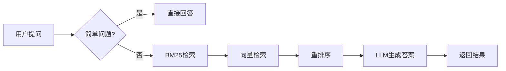

# 🛡️ Security RAG - 安保集团企业知识库智能问答系统

<div align="center">


**基于检索增强生成（RAG）技术的企业知识库智能问答系统**
专为安保集团设计，支持安保执勤、武装押运等制度文档的智能问答

[功能特性](#-功能特性) • [技术栈](#-技术栈) • [快速开始](#-快速开始) • [API文档](#-api文档) • [项目结构](#-项目结构)

</div>

---

## 📖 项目简介

**Security RAG** 是一个面向安保集团的企业级智能问答系统，基于先进的 **检索增强生成（Retrieval-Augmented Generation, RAG）** 技术构建。系统能够理解员工的自然语言问题，从企业知识库中检索相关文档，并生成准确、可靠的回答。

### 🎯 核心价值

- **📚 知识沉淀**：将分散的制度文档、操作规程转化为可检索的知识库
- **⚡ 快速响应**：毫秒级检索，秒级生成答案，大幅提升问答效率
- **🎯 精准回答**：基于向量检索和重排序技术，确保答案准确可靠
- **🔄 流式输出**：支持流式响应，提供更自然的交互体验
- **💬 对话历史**：支持多轮对话，保持上下文连贯性
- **🔒 安全可控**：本地部署，数据不出域，保障企业信息安全

---

## ✨ 功能特性

### 🤖 智能问答
- **自然语言理解**：支持员工用日常语言提问
- **多源检索**：BM25关键词检索 + 向量语义检索 + 重排序
- **智能路由**：自动判断是否需要RAG，简单问题直接回答
- **流式响应**：实时流式输出，提升用户体验

### 🔍 检索增强
- **混合检索策略**
  - BM25：传统关键词匹配，适合精确查询
  - 向量检索：语义相似度匹配，理解问题意图
  - Rerank：重排序模型，提升检索准确率
- **父子文档分块**：支持文档的层级化处理和检索
- **多数据库支持**
  - MySQL：存储业务结构化数据
  - Redis：缓存查询结果，加速响应
  - Milvus：向量存储，支持大规模语义检索

### 💻 接口服务
- **RESTful API**：标准的HTTP接口
- **WebSocket流式**：支持实时流式问答
- **会话管理**：支持对话历史记录和上下文保持
- **健康检查**：提供系统状态监控接口

### 🎨 前端界面
- **现代化UI**：基于原生 HTML/CSS/JavaScript 的问答界面
- **实时交互**：流式显示AI回答
- **多板块支持**：支持不同业务板块的知识库过滤

---

## 🛠️ 技术栈

### 后端技术
| 技术 | 版本 | 说明 |
|------|------|------|
| **Python** | 3.8+ | 核心开发语言 |
| **FastAPI** | 0.100+ | Web框架，高性能异步支持 |
| **OpenAI SDK** | latest | 兼容OpenAI API，调用LLM服务 |
| **MySQL** | 8.0+ | 关系型数据库 |
| **Redis** | 6.0+ | 缓存数据库 |
| **Milvus** | 2.3+ | 向量数据库 |

### AI/ML技术
| 技术 | 说明 |
|------|------|
| **RAG** | 检索增强生成 |
| **Embedding** | 文本向量化（BGE-M3） |
| **Reranker** | 重排序模型（BGE-Reranker） |
| **LLM** | 大语言模型（通义千问/Qwen） |

### 前端技术
| 技术 | 说明 |
|------|------|
| **HTML/CSS/JavaScript** | 无需构建即可由 FastAPI 提供的前端页面 |
| **WebSocket** | 实时通信 |

---

## 🚀 快速开始

### 📋 环境要求

- Python 3.10（当前已验证版本为 3.10.20）
- MySQL 8.0+
- Redis 6.0+
- Milvus 2.3+
- Node.js 16+（可选，用于前端开发）

### 🔧 安装步骤

#### 1️⃣ 克隆项目

```bash
git clone https://github.com/Active-007/security-rag.git
cd security_rag
```

#### 2️⃣ 配置环境

**复制配置文件模板**：
```bash
# Windows
copy config.ini.example config.ini

# Linux/Mac
cp config.ini.example config.ini
```

**编辑 `config.ini`，配置以下内容**：

```ini
# MySQL配置
[mysql]
host = your_mysql_host
port = 3306
user = root
password = your_password
database = security_rag

# Redis配置
[redis]
host = your_redis_host
port = 6379
db = 0

# Milvus配置
[milvus]
host = your_milvus_host
port = 19530
database_name = security_db
collection_name = security_knowledge

# LLM配置
[llm]
model = qwen-max
dashscope_api_key = sk-your-api-key
dashscope_base_url = https://dashscope.aliyuncs.com/compatible-mode/v1
```

> ⚠️ **重要提示**：
> - `config.ini` 包含敏感信息，已被 `.gitignore` 排除，**请勿提交到Git**
> - 所有数据库服务需要提前安装并启动

#### 3️⃣ 安装Python依赖

```bash
# 创建虚拟环境（推荐）
python -m venv venv

# 激活虚拟环境
# Windows:
venv\Scripts\activate
# Linux/Mac:
source venv/bin/activate

# 安装依赖
pip install -r requirements.txt
```

#### 4️⃣ 准备模型和知识库文档

先下载公开模型：

```bash
python scripts/download_models.py
```

脚本会准备以下目录：

```
rag_qa/models/
├── bert-base-chinese/          # BERT基础模型（中文）
├── bert_query_classifier/      # 查询分类模型
├── bge-m3/                     # 文本向量化模型
├── bge-reranker-large/         # 重排序模型
└── nlp_bert_document-segmentation_chinese-base/  # 文档分割模型
```

公开模型下载完成后，使用仓库内的 4,981 条分类训练数据重新训练查询分类器：

```bash
python -m rag_qa.core.query_classifier
```

训练结果会保存到 `rag_qa/models/bert_query_classifier/`。训练完成后执行：

```bash
python scripts/verify_restore.py
```

> 📌 **注意**：公开模型文件为数 GB，不会被 Git 跟踪。查询分类器也不上传模型权重，而是由 `security_rag/classify_data/model_generic_5000.json` 重新训练。CPU 训练可能耗时较长，并需要为最终模型和临时检查点预留约 2 GB 磁盘空间；完整步骤见 [`docs/RESTORE.md`](docs/RESTORE.md)。

原始知识库文档默认不会进入 Git，以防业务资料意外公开。删除本地项目前，必须按 [`docs/RESTORE.md`](docs/RESTORE.md) 将文档纳入经过确认的私有仓库，或保存到单独的加密备份。

#### 5️⃣ 启动服务

**方式一：直接启动FastAPI服务**

```bash
python app.py
```

服务将在 `http://localhost:8003` 启动

**方式二：使用命令行参数**

```bash
# 启动API服务
python app.py

# 或进入交互式查询模式
python rag_qa/rag_main.py
```

#### 6️⃣ 访问系统

打开浏览器访问：`http://localhost:8003`

---

## 📚 API文档

### 基础接口

#### 🔍 查询接口

**非流式查询**：
```http
POST /api/query
Content-Type: application/json

{
  "query": "什么是安保执勤制度？",
  "session_id": "optional-session-id"
}
```

**响应**：
```json
{
  "answer": "安保执勤制度是指...",
  "is_streaming": false,
  "session_id": "uuid-string",
  "processing_time": 1.234
}
```

**流式查询（WebSocket）**：
```javascript
const ws = new WebSocket('ws://localhost:8003/api/stream');

ws.onopen = () => {
  ws.send(JSON.stringify({
    query: "什么是武装押运？",
    session_id: "session-id"
  }));
};

ws.onmessage = (event) => {
  const data = JSON.parse(event.data);
  console.log(data.type, data.token); // 'token' | 'end' | 'error'
};
```

#### 💬 会话管理

**创建新会话**：
```http
POST /api/create_session
```

**获取历史记录**：
```http
GET /api/history/{session_id}
```

**清除历史记录**：
```http
DELETE /api/history/{session_id}
```

#### 🏥 健康检查

```http
GET /health
```

**响应**：
```json
{
  "status": "healthy"
}
```

#### 📂 获取数据来源

```http
GET /api/sources
```

**响应**：
```json
{
  "sources": ["security_duty", "armed_escort"]
}
```

---

## 🗂️ 项目结构

```
security_rag/
├── app.py                      # FastAPI主应用（Web服务入口）
├── config.ini.example          # 配置文件模板
├── config.ini                  # 实际配置（不提交到Git）
├── requirements.txt            # Python依赖
│
├── base/                       # 基础配置模块
│   ├── config.py              # 配置管理类
│   └── logger.py              # 日志管理
│
├── rag_qa/                     # RAG核心模块
│   ├── rag_main.py            # RAG系统主入口
│   ├── core/                  # 核心组件
│   │   ├── document_processor.py    # 文档处理
│   │   ├── vector_store.py          # 向量存储
│   │   ├── rag_system.py            # RAG系统（旧版）
│   │   ├── new_rag_system.py        # RAG系统（新版，支持流式）
│   │   ├── query_classifier.py      # 查询分类器
│   │   ├── strategy_selector.py     # 检索策略选择
│   │   └── prompts.py               # 提示词模板
│   │
│   ├── document_loaders/       # 文档加载器
│   │   ├── doc_loader.py      # Word文档加载
│   │   ├── pdf_loader.py      # PDF加载
│   │   ├── ppt_loader.py      # PPT加载
│   │   └── img_loader.py      # 图片加载
│   │
│   ├── text_spliter/           # 文本分割器
│   │   ├── chinese_recursive_text_splitter.py
│   │   └── model_text_spliter.py
│   │
│   ├── rag_assessment/         # RAG评估
│   │   ├── ragas_evaluate.py
│   │   └── rag_evaluate_data_small.json
│   │
│   └── models/                 # 预训练模型（不提交到Git）
│       ├── bert-base-chinese/
│       ├── bert_query_classifier/
│       ├── bge-m3/
│       ├── bge-reranker-large/
│       └── nlp_bert_document-segmentation_chinese-base/
│
├── mysql_qa/                   # MySQL问答模块（独立功能）
│   ├── sql_main.py            # MySQL问答入口
│   ├── db/                    # 数据库操作
│   │   └── mysql_client.py
│   ├── retrieval/              # 检索模块
│   │   └── bm25_search.py
│   ├── cache/                  # 缓存模块
│   │   └── redis_client.py
│   └── utils/                  # 工具函数
│
├── security_rag/               # 数据分类模块
│   └── classify_data/          # 数据分类脚本
│       ├── generate_training_data.py
│       └── model_generic_5000.json
│
└── static/                      # 前端静态资源
    └── index.html
```

---

## 🔄 工作流程

### 📊 数据处理流程


### 💬 问答流程



---

## ⚙️ 配置说明

### 环境变量

配置支持环境变量优先级，可覆盖 `config.ini` 中的设置：

```bash
# 数据库配置
export MYSQL_HOST=192.168.1.100
export MYSQL_PORT=3306
export REDIS_HOST=192.168.1.100
export MILVUS_HOST=192.168.1.100

# LLM配置
export LLM_MODEL=qwen-max
export DASHSCOPE_API_KEY=sk-your-key

# 检索参数
export PARENT_CHUNK_SIZE=1000
export RETRIEVAL_K=5
```

### 数据库初始化

**MySQL**：
```sql
CREATE DATABASE IF NOT EXISTS security_rag;
```

创建数据库后，配置 `config.ini`，再执行 `python -m mysql_qa.db.mysql_client` 创建 `security_qa` 表并导入仓库内的初始 CSV 数据。

**Milvus**：
```python
# 创建数据库和集合
from pymilvus import connections, db, Collection

connections.connect("default", host="localhost", port="19530")
db.create_database("security_db")
```

**Redis**：
```bash
# 默认无需特殊配置，选择数据库即可
redis-cli -n 0
```

---

## 🧪 开发指南

### 代码结构

- **`base/`**：基础设施（配置、日志）
- **`rag_qa/core/`**：RAG核心逻辑
- **`rag_qa/document_loaders/`**：多格式文档解析
- **`mysql_qa/`**：MySQL问答独立模块
- **`app.py`**：Web服务入口

### 添加新功能

1. **添加新的文档加载器**：
   - 在 `rag_qa/document_loaders/` 创建新的加载器
   - 继承基类或实现统一接口

2. **修改检索策略**：
   - 编辑 `rag_qa/core/strategy_selector.py`
   - 调整检索权重和阈值

3. **自定义提示词**：
   - 修改 `rag_qa/core/prompts.py`

### 测试

```bash
# 启动交互式查询模式
python rag_qa/rag_main.py

# 或运行数据预处理
python rag_qa/rag_main.py --data-processing --data-dir ./rag_qa/data
```

---

## 🚢 部署指南

### Docker 部署

当前仓库没有提供经过验证的一键 Docker 编排；MySQL、Redis、Milvus、模型和私有知识文档都需要按实际部署环境挂载或单独配置。请先按 [`docs/RESTORE.md`](docs/RESTORE.md) 完成手动恢复和验收，再制作部署镜像。

### 手动部署

1. **服务器环境准备**
   ```bash
   # 安装 Python 3.10
   sudo apt-get install python3.10 python3-pip

   # 安装MySQL、Redis、Milvus
   # 参考官方文档
   ```

2. **上传代码和配置**
   ```bash
   # 上传项目代码
   scp -r security_rag user@server:/opt/

   # 上传配置文件（单独传输，不通过Git）
   scp config.ini user@server:/opt/security_rag/
   ```

3. **安装依赖并启动**
   ```bash
   cd /opt/security_rag
   python -m venv venv
   source venv/bin/activate
   pip install -r requirements.txt
   python app.py
   ```

4. **配置Nginx反向代理**（可选）
   ```nginx
   server {
       listen 80;
       server_name your-domain.com;

       location / {
           proxy_pass http://localhost:8003;
           proxy_set_header Host $host;
           proxy_set_header X-Real-IP $remote_addr;
       }

       location /api/stream {
           proxy_pass http://localhost:8003;
           proxy_http_version 1.1;
           proxy_set_header Upgrade $http_upgrade;
           proxy_set_header Connection "upgrade";
       }
   }
   ```

---

## 📝 常见问题

### Q1: 连接数据库失败

**A**: 检查以下几点：
- 数据库服务是否已启动
- `config.ini` 中的 host、port 配置是否正确
- 网络连通性（`ping`、`telnet` 测试）
- 防火墙规则是否允许连接

### Q2: 模型文件过大无法上传

**A**: 模型文件（约6.4GB）已被 `.gitignore` 排除，需要手动下载：
- 参考 `rag_qa/models/` 目录结构
- 从HuggingFace或ModelScope下载
- 放置到对应目录

### Q3: LLM调用失败

**A**: 检查以下配置：
- `dashscope_api_key` 是否正确
- 账户是否有可用余额
- `dashscope_base_url` 是否可访问
- 网络是否能访问阿里云服务

### Q4: 检索结果不准确

**A**: 可调整以下参数：
- 调整 `parent_chunk_size` 和 `child_chunk_size`
- 修改 `retrieval_k` 和 `candidate_m`
- 检查文档分块质量
- 验证向量模型是否正确加载

### Q5: 如何添加新的业务板块？

**A**: 在 `config.ini` 中修改：
```ini
[app]
valid_sources = ["security_duty", "armed_escort", "new_section"]
```
并准备对应的数据目录 `new_section_data/`。

---

## 🤝 贡献指南

欢迎提交 Issue 和 Pull Request！

### 开发流程

1. Fork 本仓库
2. 创建特性分支：`git checkout -b feature/your-feature`
3. 提交更改：`git commit -m 'Add some feature'`
4. 推送到分支：`git push origin feature/your-feature`
5. 提交 Pull Request

### 代码规范

- 遵循 PEP 8 规范
- 添加必要的注释和文档字符串
- 编写单元测试（待完善）
- 提交信息使用英文，清晰明了

---

## 📄 许可证

本项目采用 MIT 许可证 - 详见 [LICENSE](LICENSE) 文件

---

## 📞 联系方式

- **项目维护者**：nie-jianxuan
- **代码仓库**：https://github.com/Active-007/security-rag
- **问题反馈**：请在 GitHub 提交 Issue

---

## 🙏 致谢

感谢以下开源项目：

- [FastAPI](https://fastapi.tiangolo.com/) - 现代化的Web框架
- [LangChain](https://langchain.com/) - LLM应用开发框架
- [Milvus](https://milvus.io/) - 开源向量数据库
- [BGE](https://github.com/FlagOpen/FlagEmbedding) - 高质量Embedding模型
- [通义千问](https://dashscope.aliyun.com/) - 阿里云大语言模型

---

<div align="center">

**⭐ 如果这个项目对你有帮助，请给我们一个Star！⭐**

Made with ❤️ by Security RAG Team

</div>
